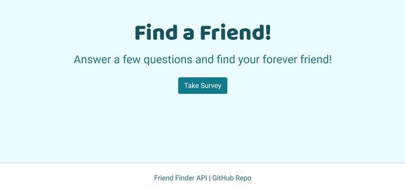

# FriendFinder
This is a front end Friend Finder application built with Bootstrap & jQuery for dynamic responsiveness, utilizing a friends API, and deployed on Heroku.

# How to use
From the Friend Finder home page, click the Take Survey button to begin. Enter your name and a link to the profile picture you would like to use.  Answer the 10 friendship compatibility questions and see who your potential next best friend could possibly be!  

### [Take the Survey!](https://boiling-reef-41189.herokuapp.com/)

Technology: HTML5 | CSS3 | Bootstrap | JavaScript | Jquery | Google Fonts | Express | Node | API
